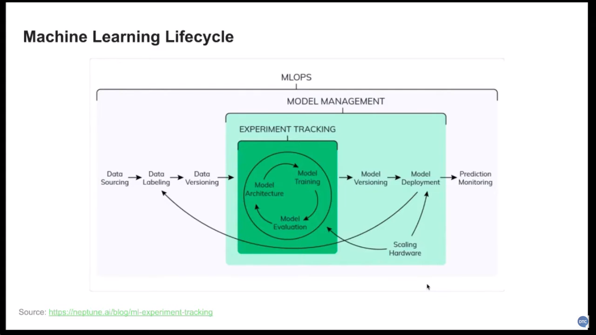

# Experiment Tracking & Model Management

Background info: **Saving model**

Saving a model means serializing the trained model to disk so it can be reused without retraining.

_How and why saving models differs from traditional machine learning (ML) and deep learning (DL)?_

1. ML: Common frameworks used are `scikit-learn`, `XGBoost`, `LightGBM`. Usually saved as pickled Python objects that are of small file size (KB-MB).
2. DL: Frameworks include `TensorFlow`, `PyTorch`, `Keras`. Models are saved as custom binary formats which are framework natives like like `.pt`, `SavedModel`, `.h5` and are of large file size (MB-GB).

In short: when saving models think from a **workflow and deployment perspective**.

## Understanding Machine Learning Lifecycle

The ML lifecycle includes stages such as data collection, model training, evaluation, deployment, and continuous monitoring — structured approach to effectively manage machine learning models.

The CRISP-DM, which stands for Cross-Industry Standard Process for Data Mining, is a widely adopted framework that outlines the steps involved in a data analytics, data science or machine learning project.

## Model Management

**Using MLflow**: Allows users to log experiments, save models as artifacts, and track parameters and metrics throughout the lifecycle of model development.

- Model Logging: Logs metrics, parameters, and models for future retrieval and use.
  - Two methods: logging a model as an artifact and logging it as an MLflow model.
  - MLflow model has more advantages as it includes dependencies and environment specifications, which is crucial for deployment and reproducibility.
- Framework Support: Supports multiple frameworks for saving and loading models in various formats.
- Predictive Capabilities: Facilitates making accurate predictions with properly logged and stored models.
  - Load models as either Python functions or specific framework objects.

## Model Registry

**Introduction**: Why is there a need for a model registry?

- Challenge: Communication gaps between data scientists and engineers complicate deployment.
- Solution: Model registry streamlines the process by centralizing model info i.e. model changes, hyperparameters, and required preprocessing.

**Model Registration**: How are models documented and controlled before deployment?

- Process: Data scientists register models based on performance and readiness (metrics: training duration, model size, and error rates).
- Access: Deployment engineers view and manage models through the registry.

**Promotion of Models**: How do models transition through various stages in their lifecycle?

- Stages: Models can be moved to production, staging, or archived.
- Evaluation: Used performance metrics to determine model suitability for production.

**Transitioning Stages**: How to promote or archive models based on evaluation?

- Testing: Models are tested against new data to validate performance.
- Decisions: Engineers decide on promotions based on test results and metrics.

**Model Lineage**: Focuses on maintaining relationships between model versions and training data.

- History: Automatic versioning keeps track of changes and updates.
- Retrieval: Models can be traced back to their training experiments for verification.

**MLflow**: Practical use of MLflow for model tracking and registration.

- Logging: MLflow tracks experiments, models, and parameters effectively.
- Registration: Demonstrates how to register and transition model versions smoothly.
- Other commands: Retrieving performance metrics, and transitioning models between stages.
