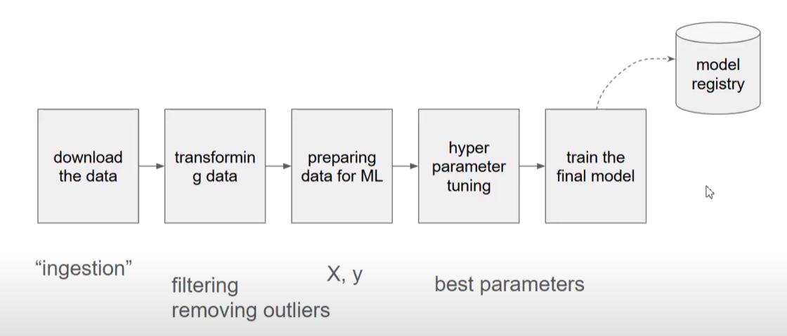

# Machine Learning Pipelines



The goal: Transform a Jupyter notebook containing numerous experiments into a structured and efficient training pipeline that is reproducible and maintainable.

ML pipelines are structured sequences of steps for producing models, encompassing data ingestion, transformation, feature engineering, hyperparameter tuning, and model saving in a model registry.

## Pipeline Overview

### Data Downloading

- The initial step in the training pipeline involves downloading data a.k.a. data ingestion.
- Critical as the quality and the structure of the data directly impact the subsequent steps in the machine learning process.

### Data Transformation Techniques

- Data must undergo transformation - includes cleaning, filtering, aggregating, converting data types and removing outliers
- Essential to ensure that the data is structured appropriately for feature engineering.

### Data Preparation

- Select the `X` (input features) and `y` (corresponding target or output)

### Hyperparameter Tuning

- Identifying the best parameters through systematic experimentation.
- Use of libraries such as `Hyperopt` and algorithm like `XGBoost`.

### Train Final Model and Model Registry

- Saving the best performing trained model for easy future access and deployment.

## From Notebook to Script

```python
jupyter nbconvert --to script my_notebook.ipynb
```

- Convert Jupyter notebooks into Python scripts to create a more maintainable and organized workflow.
- Allows for the implementation of functions that encapsulate different stages of the pipeline, making it easier to manage and execute.
- _This alone does not address more complex orchestration needs._
- Use orchestration tools like Apache Airflow and Prefect to address complex needs.
